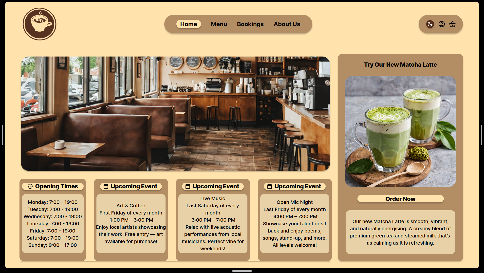
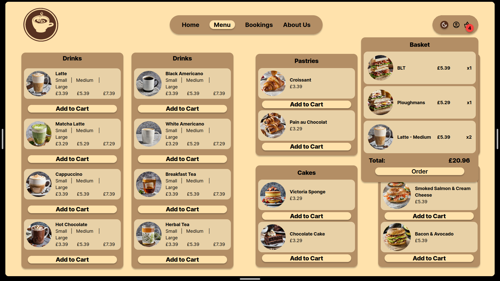
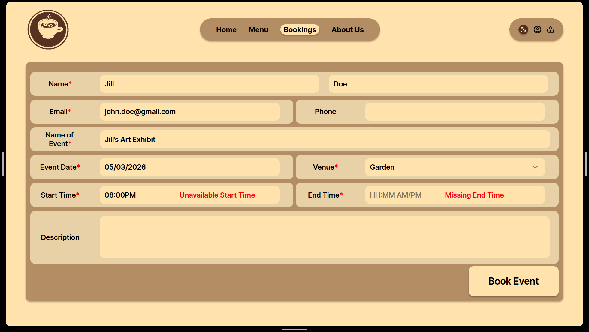
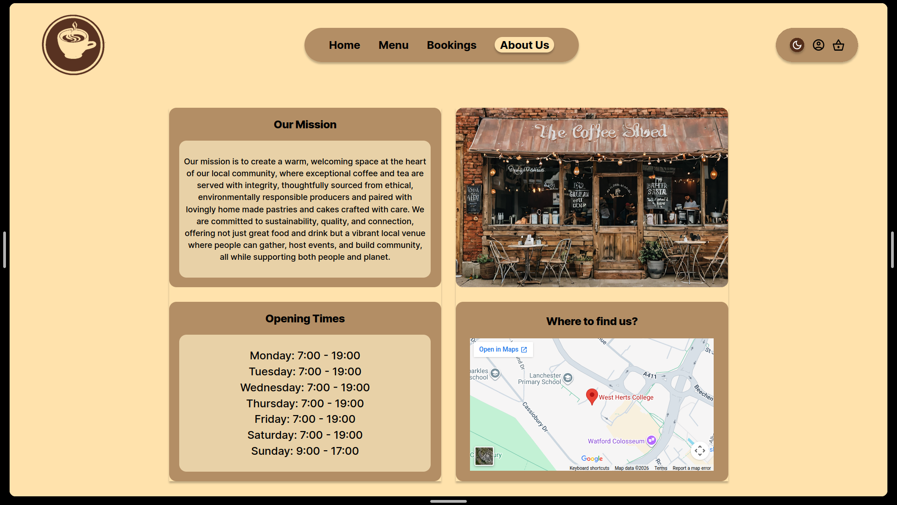

# Cafe Beans

## Links

- [Figma](https://www.figma.com/site/9wtEjPA0OyluATfaWmhODe/DUX?node-id=0-1&t=Q3sWnxOSZ9HOJI2K-1)
- [Colour Pallette](https://www.canva.com/colors/color-palettes/neutral-meeting-ground/)

# Justification & Analysis
Business Justification
Coffee is a beverage that many people consume on a daily basis, often not within the confines of their own home, this is for many reasons, but the main one is convenience. For many this creates a reliance on coffee shops to fill this void in their day. Additionally online ordering has seen a dramatic increase in previous years meaning business have had to adapt to this change in the market. 

Many large brands have bespoke websites that fulfil the need to be online but, in our opinion, they lack one thing that we believe is vital, character and personality. For instance, Starbucks website has a distinctly sterile and impersonal feel to it. At the most basic level their colour palette is remarkably simple, just their signature green set on white. This is a problem that we intend to address with the development of our website.

While we will not be reinventing the wheel as such with design principles and over the top gimmicks, we believe that we have created a website that all users will feel comfortable using. 

Competitive Analysis

-	Featured most prominently on the home page of the Starbucks website is an advertisement for their app. When a user enters the home page it is not likely that their first instinct will be to leave it immediately to enter their respective app store. 
-	Abiding by Hicks Law, the user is only given a limited number of options of different pages to visit at the top of the page. This allows the user to make a much simpler choice and therefore a much quicker choice.
-	The page also demonstrates a positive Signal-to-Noise Ratio as the user is not overwhelmed by options and navigating their way through a crowded web page, all icons and text is given space to breathe.
-	Follows the Gutenberg Rule as a few pages are displayed prominently at the top of the page, at least one of which the user will need. As you descend the page information becomes less immediately relevant.

-	On the menu page of the website iconic representation is a design principle that has been demonstrated as every menu item is assigned a corresponding picture. This can prove helpful to customers who do not know what they would like to eat or drink.

-	This page also displays a great demonstration of CRAP principles

C – On the side bar the different sections are written in black and bold whereas their subsections are in a smaller lighter grey.

R – Each icons background has the same dark green colour, and all products are framed in the same way for their picture. 

A – Page is designed in a visually appealing way as all elements are in line with one another.

P – All elements related to one another are grouped together under clearly defined headings.

---
# Design Choices
## Colour Pallette

---
# User Group Profiles

## Group 1

## Group 2

## Group 3

# User Stories

---
# Wireframe

## Home Page

## Home Page Dark Mode

## Menu

## Menu Basket

## Events

## Event Form

## Event Form Error Messages

## About Us

