# Cafe Beans
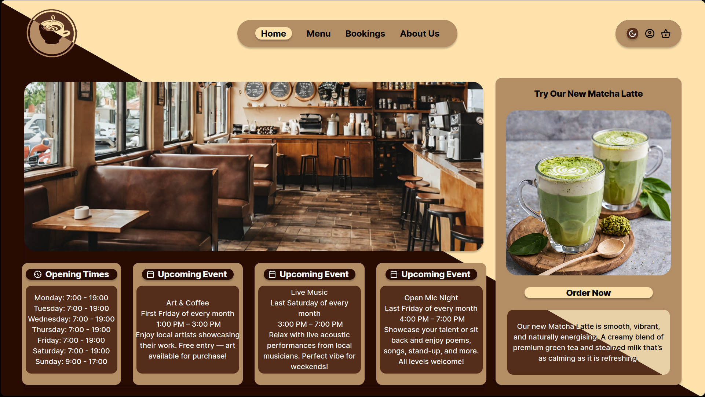

---
# User Profiles
## First Time Visitor

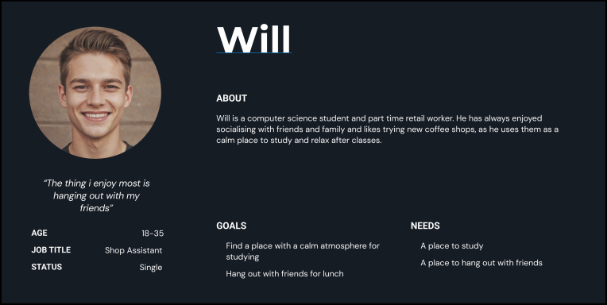

---
## Returning Visitor

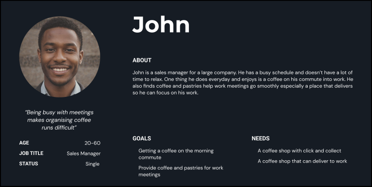

---
## Repeat Visitor

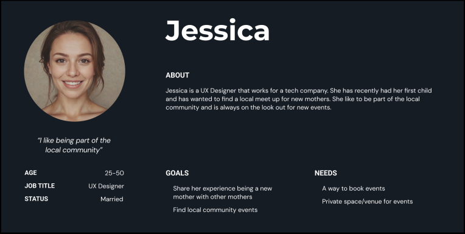
---
# Theme - Online Menu & Click and Collect

## Epic -

As a customer, I want to be able to view the cafes menu and order online so that i can click and collect on my way to work.

## Stories - 

As a customer, I want to be able to add items to a basket so that i can purchase multiple items at once.

As a customer, I want to be able to see what food and drink the cafe serves so that i can decide if i want to visit.

## Tasks - 

- Create an menu page
- Add a "Add to Basket" button on menu items
- Add basket button to top right menu
- Add order button under basket list

## Acceptance Criteria

Given the user wants to order items online, when they view the menu page, they can then add items to a basket and order them.

---
# Theme - About Page

## Epic -

As a customer, I want to be able to find more information about the cafe so that i can decide if i want to visit the cafe.

## Stories - 

As a customer, I want to be able to open the location in a map application to use for directions.

As a customer, I want to be able to view the mission statement of the cafe so that i can decide if i want to visit the cafe.

As a customer, I want to be able to see the opening times of the cafe so that i know when i can visit the cafe.

## Tasks - 

- Create an about us page
- Add a mission statement
- Add opening times to the about page
- Add a Google location map on the about us page
- Make map open Google maps for directions

## Acceptance Criteria

Given the user wants to find the location of the coffee shop, when they view the about us page, they can see a Google map view of our location and when clicked will re-direct to Google maps for directions.

---
# Theme - Event Bookings

## Epic -

As a customer, I want to be able to book events to be hosted by the cafe.

## Stories - 

As a customer, I want to be able to view upcoming events so that i can decide if i want attend.

As a customer, I want to be able to book an event at the cafe so that i can create local monthly meet ups.

## Tasks - 

- Create an Bookings page
- Add a "Book Event" button
- Add bookings form page
- Add calendar with upcoming events

## Acceptance Criteria

Given the user wants to book events, when they view the events page they will see a "Book Event" button which will take them to the event form. There they can fill out the required fields and book the event.

---
# Justification & Analysis
## Business Justification

Coffee is a beverage that many people consume on a daily basis, often not within the confines of their own home, this is for many reasons, but the main one is convenience. For many this creates a reliance on coffee shops to fill this void in their day. Additionally online ordering has seen a dramatic increase in previous years meaning business have had to adapt to this change in the market. 

Many large brands have bespoke websites that fulfil the need to be online but, in our opinion, they lack one thing that we believe is vital, character and personality. For instance, Starbucks website has a distinctly sterile and impersonal feel to it. At the most basic level their colour palette is remarkably simple, just their signature green set on white. This is a problem that we intend to address with the development of our website.

While we will not be reinventing the wheel as such with design principles and over the top gimmicks, we believe that we have created a website that all users will feel comfortable using. 

## Competitive Analysis

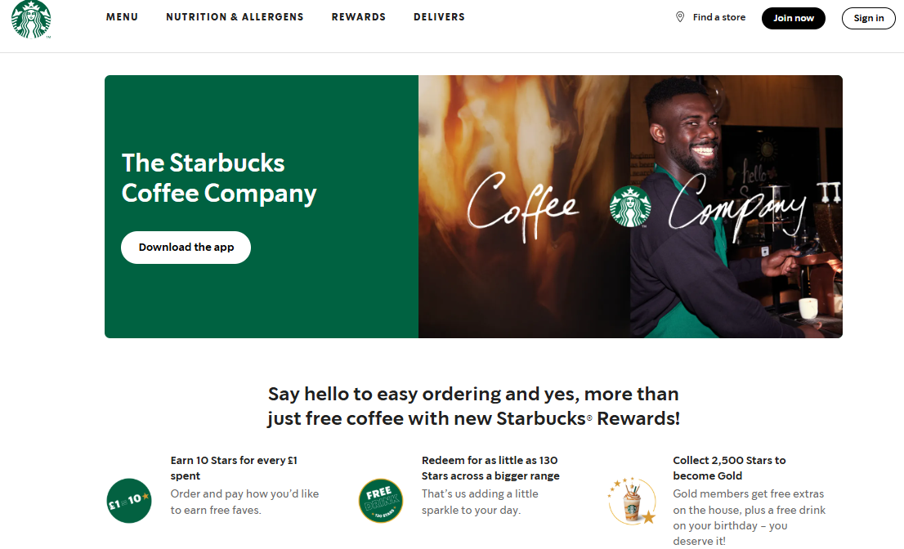
-	Featured most prominently on the home page of the Starbucks website is an advertisement for their app. When a user enters the home page it is not likely that their first instinct will be to leave it immediately to enter their respective app store. 
-	Abiding by Hicks Law, the user is only given a limited number of options of different pages to visit at the top of the page. This allows the user to make a much simpler choice and therefore a much quicker choice.
-	The page also demonstrates a positive Signal-to-Noise Ratio as the user is not overwhelmed by options and navigating their way through a crowded web page, all icons and text is given space to breathe.
-	Follows the Gutenberg Rule as a few pages are displayed prominently at the top of the page, at least one of which the user will need. As you descend the page information becomes less immediately relevant.

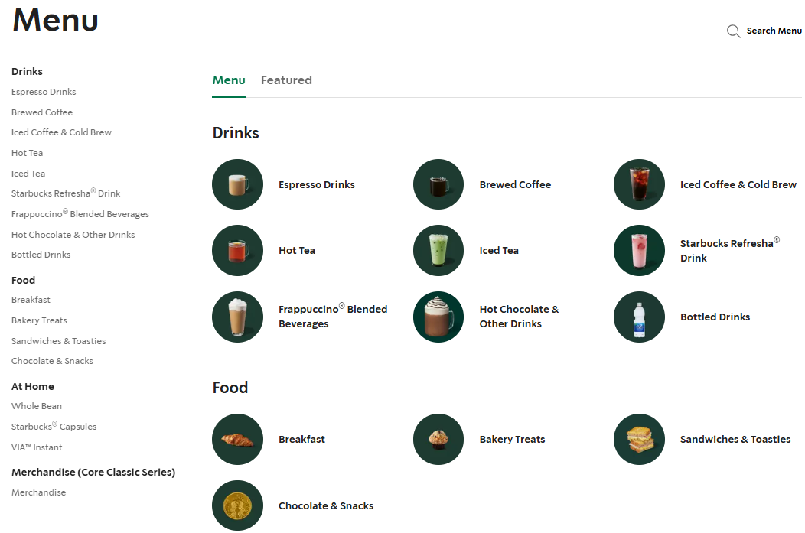
-	On the menu page of the website iconic representation is a design principle that has been demonstrated as every menu item is assigned a corresponding picture. This can prove helpful to customers who do not know what they would like to eat or drink.

-	This page also displays a great demonstration of CRAP principles

C – On the side bar the different sections are written in black and bold whereas their subsections are in a smaller lighter grey.

R – Each icons background has the same dark green colour, and all products are framed in the same way for their picture. 

A – Page is designed in a visually appealing way as all elements are in line with one another.

P – All elements related to one another are grouped together under clearly defined headings.

---
# Design Choices
The wireframe follows the design principle of Ockham’s Razor where we have made sure to keep things simple for the user by only showing what is needed on each page and keeping the overall layout minimalist.

During the design of the wireframe we experimented with having the Cafe logo in the center top of the webpage. This didn’t explicitly follow the Gutenberg Diagram but after some time we realised that the logo pushed all the content lower down the page making it cluttered. By moving the logo inline with the top menu and to the top left it allows the user's eye to flow from the logo to the navigation menu.

---
## Colour Pallette
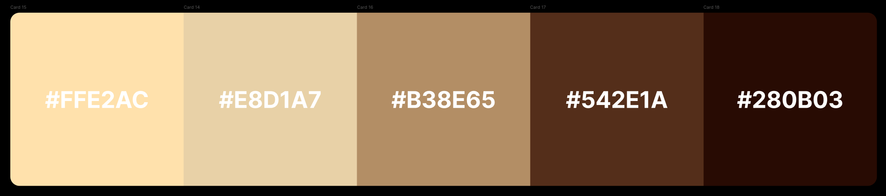
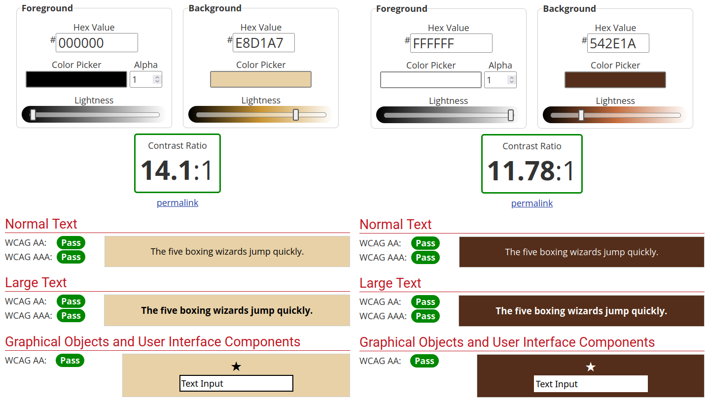
We used the - 1.4.3/1.4.6 - Contrast - Contrast of at least 4:5:1/ Contrast of at least 7:1 Web Content Accessibility Guideline (WCAG) to make sure the contrast between text and text box colour was readable. Shown in the screenshot we meet all ratings for both minimum and enhanced guidelines. (WCAG, 2025), (WCAG, 2025), (WebAIM, 2025)

---
We used icons like a calendar and clock to further represent the events and opening times respectively. We also used Iconic Representation to show the dark/light mode toggle and basket as they do not have titles to describe the button.

## Icons
[Google Materials Icons](https://fonts.google.com/icons?selected=Material+Symbols+Outlined:keyboard_arrow_down:FILL@0;wght@400;GRAD@0;opsz@24&icon.query=arrow&icon.size=24&icon.color=%23e3e3e3)

### Account Icon

### Shopping Basket

### Calendar and Clock Icons

### Navigation Icons

### Light/Dark Mode Icons

---
# Wireframe

## Home Page

- Drop shadows have been added to the clickable items. This has been done to make it clearer to users which items they are able to interact with as it is not always clear to all users
- To improve the readability of the text blocks a greater contrast of colours has been used. This means whatever colour scheme that a user is using, they will be able to read it without any difficulty
- To make it clear to users which buttons are active we have added a highlight feature to the wireframe. This has been done to clearly communicate to the user which part of the website they are interacting with
- Separate colours were used for text blocks and buttons, this decision was made to improve clarity for the user

## Home Page Dark Mode
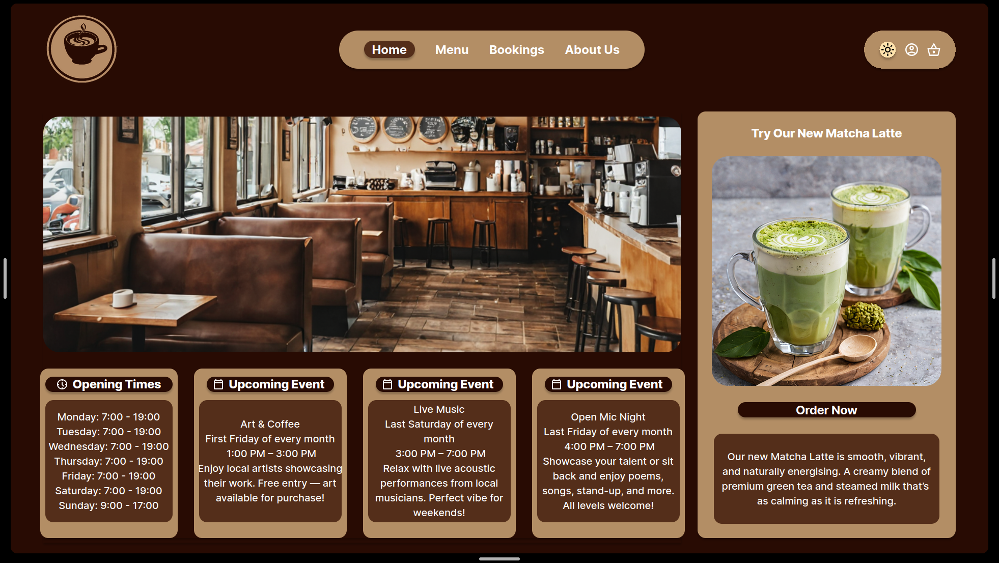
- To easily communicate to the user which colour mode they are using we have added different buttons for their respective mode and additionally added contrasting colours

## Menu
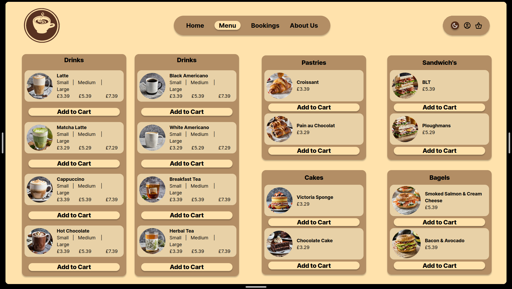
- We chose to make the text on buttons and the card title bold to improve user readability

## Menu Basket

## Events
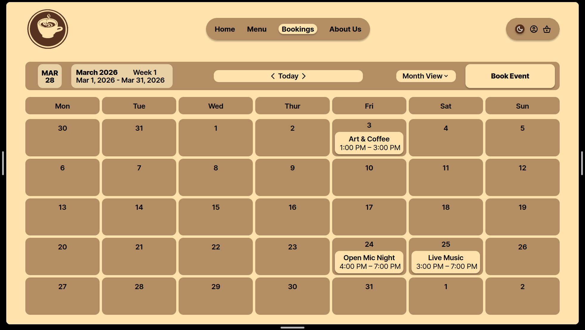

## Event Form
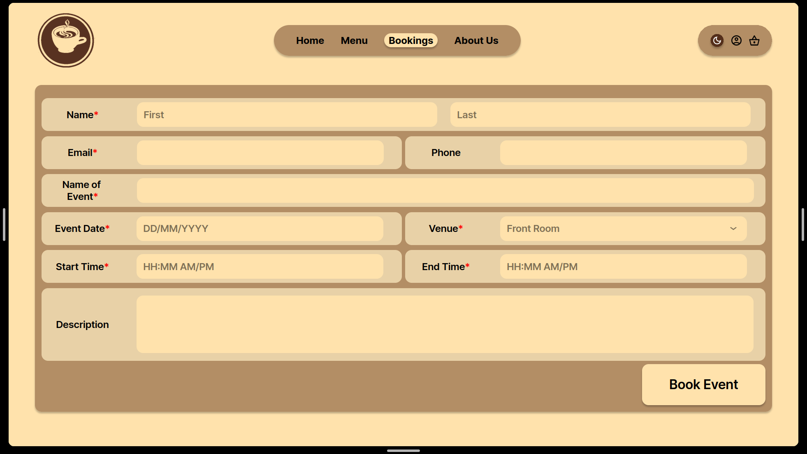

## Event Form Error Messages

## About Us

---
# References
WCAG. (2026) Understanding SC 1.4.6: Contrast (Enhanced) (Level AAA). Available at: https://www.w3.org/WAI/WCAG22/Understanding/contrast-enhanced.html [Accessed: 12 March 2026]

WCAG. (2026) Understanding SC 1.4.3: Contrast (Minimum) (Level AA). Available at: https://www.w3.org/WAI/WCAG22/Understanding/contrast-minimum.html [Accessed: 12 March 2026]

WCAG. (2026) Understanding SC 2.4.2: Page Titled (Level A). Available at: https://www.w3.org/WAI/WCAG21/Understanding/page-titled [Accessed: 12 March 2026]

WebAIM. (2026) Contrast Checker. Available at: https://webaim.org/resources/contrastchecker/ [Accessed: 12 March 2026]

